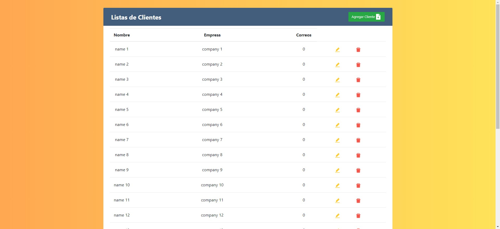
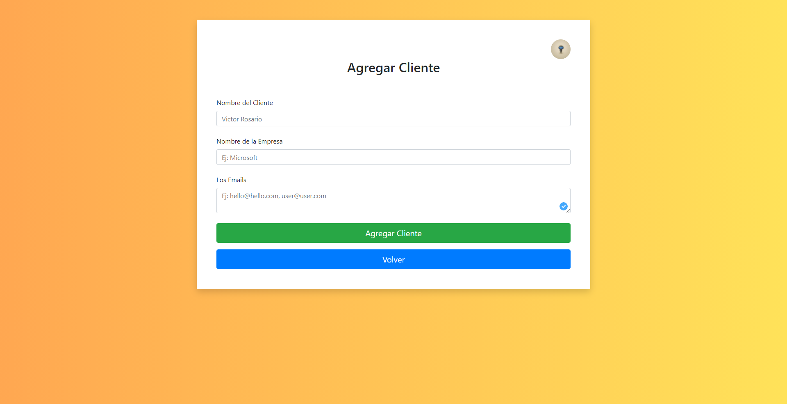

# Frontend for Prueba OrionTek

## Installations

It is necessary to have software or settings already preset on your PC.

### Technologies

* [Node and NPM](https://nodejs.org/en/)
* [VS Code](https://code.visualstudio.com/)

### Clone project

```bash
git clone https://github.com/Victor1890/prueba-OrionTek.git
```

```bash
cd prueba-OrionTek
```

```bash
npm install && npm start
```

## Screenshot




## License

[MIT](https://choosealicense.com/licenses/mit/)
